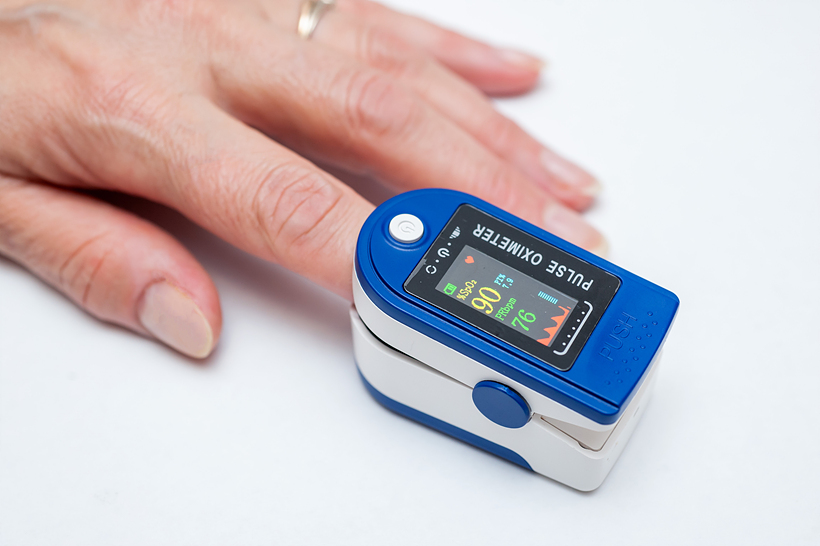
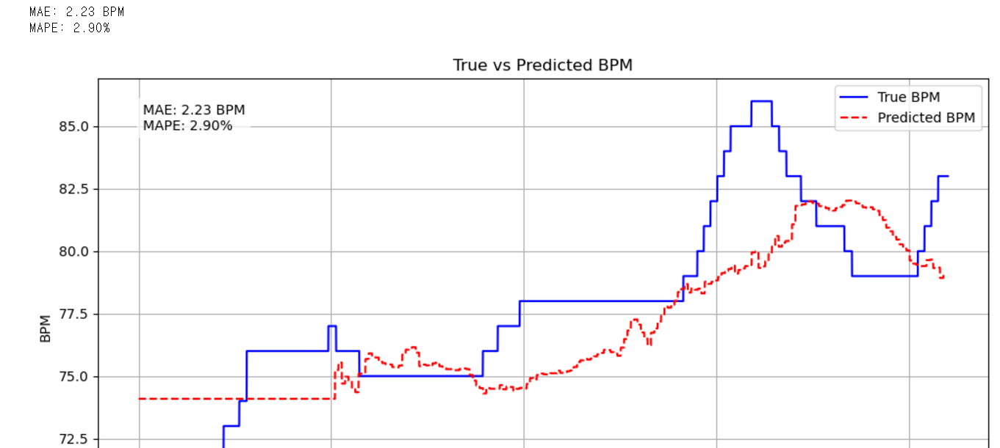

# 얼굴 영상 기반 비접촉 심박수 측정 (rPPG) 개선

웹캠 영상만으로 심박수(BPM)를 측정하는 **원격 광용적맥파(rPPG)** 시스템을 구현하고, 다채널 ROI와 신호처리 파이프라인으로 측정 정확도를 개선한 프로젝트입니다.


> 🎓 국민대학교 전자공학부 종합설계 · 2024 전자공학 공학설계 페스티벌(설계 부문)
> 🔖 관련 기술 **특허 출원**

<!-- 상단 배너 이미지 (선택) -->
<!--  -->

---

## 문제 정의

기존 심박수 측정은 신체에 센서를 접촉해야 하므로 위생·설치 비용·사용 편의성 측면에서 제약이 있습니다. 카메라만으로 측정하는 **비접촉 rPPG**가 대안이지만, 조명·움직임·개인차에 민감해 **정확도가 낮다는 한계**가 있습니다.

**목표** — 상용 웹캠 환경에서 rPPG의 측정 정확도를 실용 수준으로 끌어올리는 것.

---

## 접근 방법

1. **다채널 ROI** — 얼굴 한 곳이 아니라 여러 부위를 ROI로 나눠 신호 신뢰도를 높임
2. **G 채널 중심 신호 추출** — 혈류량 변화를 가장 잘 반영하는 초록색 채널을 BVP 신호로 사용
3. **신호처리 + 주파수 분석 결합** — 밴드패스 필터로 노이즈를 제거하고, 시간 도메인(Peak)과 주파수 도메인(FFT 등)을 함께 활용

<!-- 시스템 구성도 이미지 (assets/architecture.png 로 교체 권장) -->
```
영상 입력(웹캠)
  → MediaPipe FaceMesh (얼굴 랜드마크 468개)
  → 다채널 ROI 설정 + Gaussian Blur
  → G 채널 평균 → BVP 신호
  → Band-pass Filter (0.7~3.5Hz) + Savitzky-Golay 스무딩
  → BPM 추정  ┬ 시간 도메인: Peak Detection
              └ 주파수 도메인: FFT / Wavelet / Welch
  → 정확도 평가 (PPG 정답값 대비 MAE)
```

---

## 구현

| 구분 | 사용 기술 |
|------|-----------|
| 얼굴/ROI | OpenCV, MediaPipe FaceMesh |
| 신호처리 | NumPy, SciPy, Band-pass Filter, Savitzky-Golay, Detrending |
| BPM 추정 | Peak Detection, FFT / Wavelet / Welch Power Spectrum |
| 언어 | Python |

- 얼굴 검출은 초기 `dlib`에서 **MediaPipe로 교체**해 움직임·오검출 문제를 개선했습니다.
- 실시간 데모(웹캠)에서는 표시 BPM 안정화를 위해 **Kalman Filter·Random Forest 회귀를 실험적으로 통합**해 보았습니다. (정량 성능 평가는 아래 오프라인 방식으로 별도 수행)

<!-- ROI 시각화 이미지 -->


---

## 결과

두 가지 평가를 수행했으며, **데이터셋과 평가 조건이 다르므로 아래 두 수치는 서로 직접 비교 대상이 아닙니다.**

| 평가 | 기준 | 기존 / 문헌 | 본 프로젝트 |
|------|------|:-----------:|:-----------:|
| **① 시스템 개선** (설계 결과) | PPG 정답값 대비 MAE | 8.53 | **6.13** |
| **② 방식 비교 관찰** (UBFC-rPPG) | MAE / MAPE | Green 문헌 19.81 / 18.78% | **2.23 / 2.9%** |

> ※ ②는 단순 G 채널 방식을 UBFC-rPPG 특정 평가 조건에서 측정한 값입니다.

**핵심 관찰** — 웨이블릿·웰치·다채널 융합 등 복잡한 기법을 더할수록 개선폭은 작거나 오히려 감소하는 경우가 있었고, **잘 정제된 단순 G 채널 신호가 가장 안정적**이었습니다.

<!-- 결과 그래프 이미지 -->


---

## 배운 점

- **단순함의 가치** — 기법을 쌓는 것보다 신호를 잘 정제하는 쪽이 효과적이었습니다. "무엇을 더할까"보다 "무엇을 덜어낼까"에서 개선이 나왔습니다.
- **트레이드오프 감각** — 다채널 ROI 융합은 이론상 안정적이지만 연산량이 늘어 실시간성이 떨어졌습니다. 정확도와 응답성 사이의 균형을 직접 확인했습니다.
- **평가의 정직함** — 데이터셋·조건에 따라 수치가 크게 달라진다는 점을 겪으며, 결과를 조건과 함께 제시하는 습관을 들였습니다.

---

## 응용 분야

- **운전자 모니터링** — 운전 중 심박·졸음 상태 실시간 감지
- **헬스케어 / 피트니스** — 비대면 건강 모니터링
- **딥페이크 탐지** — 합성 영상은 정상적인 생체 신호를 재현하기 어려워, rPPG 신호의 유무·일관성으로 진위 판별에 활용 가능

---

## 코드 구조

```
rppg-portfolio/
├── README.md
├── requirements.txt
├── notebooks/
│   ├── rppg_final_green_fft_wavelet.ipynb   # 대표 구현 (G채널 + 주파수 분석)
│   └── experiments/                          # 개선 과정 기록 (POS·ROI·움직임보정 실험)
├── docs/
│   ├── presentation.pdf                      # 종합설계 발표자료
│   └── poster.pdf                            # 공학설계 페스티벌 포스터
└── assets/                                   # README 이미지
```

## 실행

```bash
pip install -r requirements.txt
jupyter notebook notebooks/rppg_final_green_fft_wavelet.ipynb   # 웹캠 필요
```

## 자료

- 📑 [발표자료](docs/presentation.pdf) · 🖼️ [포스터](docs/poster.pdf)
