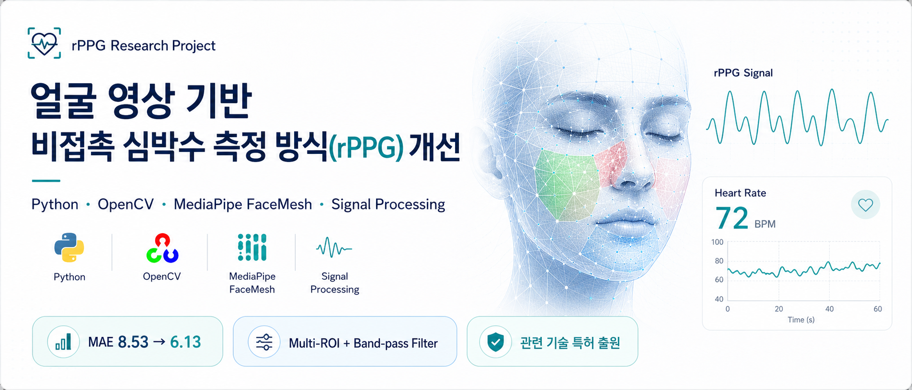
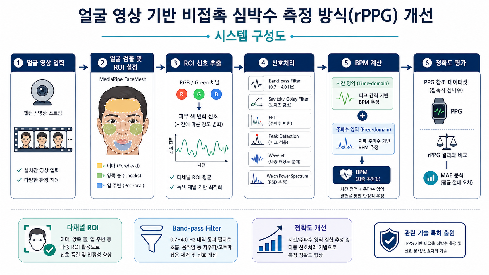
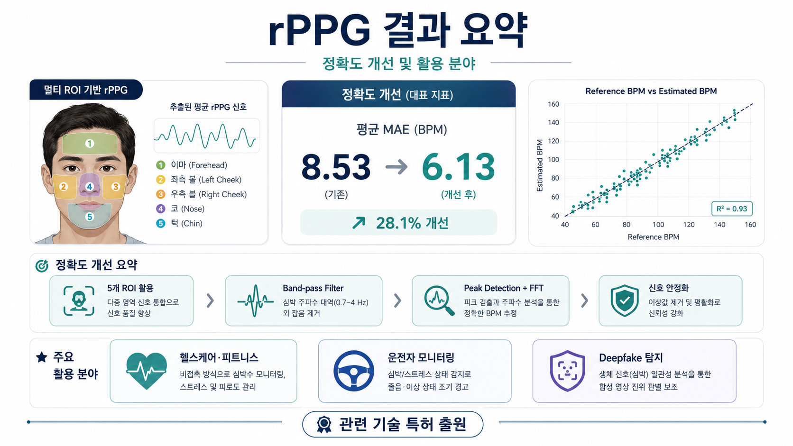

# 얼굴 영상 기반 비접촉 심박수 측정 방식(rPPG) 개선



> 웹캠 영상에서 얼굴 ROI의 미세한 피부색 변화 신호를 추출하고,  
> 신호처리 기반 BPM 추정 파이프라인을 통해 비접촉 심박수 측정 정확도를 개선한 프로젝트입니다.


---

## Quick Overview

| 항목 | 내용 |
|---|---|
| 프로젝트 | 얼굴 영상 기반 비접촉 심박수 측정 방식(rPPG) 개선 |
| 유형 | 국민대학교 전자공학부 종합설계 / 2024 전자공학 공학설계 페스티벌 출품 |
| 핵심 기술 | OpenCV, MediaPipe FaceMesh, NumPy, SciPy, Signal Processing |
| 주요 방법 | 다중 ROI 기반 색상 신호 추출, Band-pass Filter, Peak Detection, FFT |
| 대표 결과 | 최종 구현 기준 MAE 8.53 → 6.13 개선 |
| 응용 분야 | 헬스케어, 운전자 모니터링, Deepfake 탐지 |
| 특허 | 관련 기술 특허 출원 |

---

## 1. 프로젝트 개요

rPPG(Remote Photoplethysmography)는 카메라 영상에서 피부색의 미세한 변화를 분석하여 심박수와 같은 생체신호를 추정하는 비접촉 측정 기술입니다.

기존 접촉식 PPG 방식은 신체에 센서를 부착해야 하므로 위생, 설치 비용, 사용 편의성 측면에서 제약이 있습니다. 반면 rPPG는 일반 웹캠만으로 측정이 가능하다는 장점이 있지만, 조명 변화, 움직임, 얼굴 ROI 선택 방식에 따라 정확도가 크게 달라지는 한계가 있습니다.

본 프로젝트에서는 MediaPipe FaceMesh를 이용해 얼굴 ROI를 추출하고, ROI별 색상 변화 신호를 분석하여 심박수를 추정했습니다. 또한 Band-pass Filter, Peak Detection, FFT 등 신호처리 기법을 적용하여 기존 방식 대비 측정 오차를 줄이는 것을 목표로 했습니다.

---

## 2. 문제 정의

비접촉 심박수 측정 시스템을 구현하기 위해 다음 문제를 해결해야 했습니다.

| 문제 | 설명 |
|---|---|
| ROI 불안정성 | 얼굴 일부 영역만 사용할 경우 조명, 표정, 움직임에 따라 신호 품질이 크게 달라짐 |
| 노이즈 영향 | 호흡, 움직임, 조명 변화 등으로 인해 피부색 변화 신호에 잡음이 포함됨 |
| BPM 튐 현상 | Peak Detection 결과가 노이즈에 민감하여 순간적으로 비정상적인 BPM이 발생함 |
| 실시간성 문제 | 여러 ROI와 복잡한 신호처리를 모두 적용하면 연산량이 증가함 |
| 평가 기준 문제 | 데이터셋과 조건에 따라 MAE 결과가 달라져 결과 해석에 주의가 필요함 |

---

## 3. 시스템 구성도



처리 흐름은 다음과 같습니다.

1. 웹캠 또는 영상 데이터 입력
2. MediaPipe FaceMesh 기반 얼굴 랜드마크 검출
3. 이마, 볼, 입 주변 등 다중 ROI 설정
4. ROI별 RGB / Green 채널 평균값 추출
5. Band-pass Filter를 이용한 심박수 대역 신호 추출
6. Peak Detection 및 FFT 기반 BPM 추정
7. PPG 기준값과 비교하여 MAE 평가

---

## 4. 접근 방법

### 4.1 다중 ROI 기반 신호 추출

단일 ROI만 사용할 경우 얼굴의 움직임이나 조명 변화에 취약하다고 판단했습니다.  
따라서 이마, 양쪽 볼, 입 주변 등 여러 얼굴 영역을 ROI로 설정하고, 각 영역의 색상 변화 신호를 비교했습니다.

### 4.2 Green 채널 중심 BVP 신호 구성

rPPG에서는 피부 아래 혈류량 변화가 RGB 채널 중 Green 채널에 비교적 잘 반영됩니다.  
본 프로젝트에서는 ROI별 Green 채널 평균값을 시간에 따라 추출하여 BVP(Blood Volume Pulse) 신호로 사용했습니다.

### 4.3 신호처리 기반 BPM 추정

추출된 BVP 신호에는 조명 변화, 움직임, 고주파 잡음이 포함될 수 있습니다.  
이를 줄이기 위해 Band-pass Filter와 smoothing을 적용하고, Peak Detection과 FFT 기반 분석을 통해 BPM을 추정했습니다.

---

## 5. 구현 내용

| 구분 | 사용 기술 |
|---|---|
| 얼굴 검출 / ROI | OpenCV, MediaPipe FaceMesh |
| 신호 추출 | RGB / Green 채널 평균값 추출 |
| 전처리 | Band-pass Filter, Savitzky-Golay Filter, Detrending |
| BPM 추정 | Peak Detection, FFT, Wavelet, Welch Power Spectrum |
| 분석 환경 | Python, NumPy, SciPy, Jupyter Notebook |

구현 과정에서 초기 얼굴 검출 방식은 안정성이 부족하다고 판단하여 MediaPipe FaceMesh 기반으로 변경했습니다. 이를 통해 얼굴 랜드마크를 기준으로 ROI를 설정하고, 프레임마다 ROI 신호를 추출할 수 있도록 구성했습니다.

일부 실험에서는 Kalman Filter, Random Forest 회귀 등 추가 보정 방법도 검토했으나, 정량 성능 평가는 별도 조건에서 수행했습니다.

---

## 6. 실험 화면 및 신호 시각화

실제 웹캠 입력에서 MediaPipe FaceMesh를 이용해 얼굴 ROI를 설정하고,  
ROI별 색상 변화 신호를 추출하여 rPPG 신호와 BPM을 계산했습니다.

<table>
  <tr>
    <td width="50%">
      
      <br>
      <b>FaceMesh 기반 ROI 추출</b>
      <br>
      얼굴 랜드마크를 기준으로 이마, 볼, 턱 등 여러 ROI를 설정하고 색상 변화 신호를 추출했습니다.
    </td>
    <td width="50%">
      
      <br>
      <b>rPPG 신호 및 BPM 결과</b>
      <br>
      추출된 BVP 신호를 필터링한 뒤 Peak Detection과 주파수 분석을 통해 BPM을 계산했습니다.
    </td>
  </tr>
</table>

---

## 7. 결과 요약



본 프로젝트에서는 최종 구현 결과와 추가 실험 결과를 분리하여 정리했습니다.  
두 수치는 데이터셋과 평가 조건이 다르므로 직접 비교하지 않고, 각각의 실험 조건 안에서 해석했습니다.

| 평가 | 기준 | 기존 / 문헌 | 본 프로젝트 |
|---|---|:---:|:---:|
| **① 시스템 개선** | PPG 정답값 대비 MAE | 8.53 | **6.13** |
| **② 방식 비교 관찰** | UBFC-rPPG 기준 MAE / MAPE | 19.81 / 18.78% | **2.23 / 2.9%** |

> ①은 최종 구현 결과를 대표 성능으로 정리한 값입니다.  
> ②는 UBFC-rPPG 데이터셋의 특정 평가 조건에서 Green 채널 기반 방식의 성능을 관찰한 결과입니다.

### 핵심 관찰

복잡한 신호처리 기법을 계속 추가한다고 항상 성능이 좋아지는 것은 아니었습니다.  
Wavelet, Welch Power Spectrum, 다중 ROI 융합 등 여러 기법을 실험했지만, 조건에 따라 개선폭이 작거나 오히려 성능이 감소하는 경우도 있었습니다.

이를 통해 본 프로젝트에서는 **복잡한 모델을 추가하는 것보다, 신호 품질이 좋은 ROI와 Green 채널 기반 BVP 신호를 안정적으로 추출하는 것이 중요하다**는 점을 확인했습니다.

---

## 8. 담당 역할

- MediaPipe FaceMesh 기반 얼굴 랜드마크 검출 및 ROI 설정
- ROI별 RGB / Green 채널 평균값 추출
- Band-pass Filter, Peak Detection, FFT 기반 BPM 추정 실험
- 다중 ROI 적용 전후 성능 비교
- 실험 결과 시각화 및 발표/포스터 자료 구성
- rPPG 기반 비접촉 생체신호 분석의 응용 가능성 정리

---

## 9. 트러블슈팅

### 9.1 얼굴 ROI 추적 불안정

**문제**  
초기 얼굴 검출 방식에서는 얼굴이 움직이거나 조명이 변할 때 ROI 위치가 불안정해지는 문제가 있었습니다.

**해결**  
MediaPipe FaceMesh를 활용하여 얼굴 랜드마크를 기준으로 ROI를 설정하도록 변경했습니다.

**결과**  
프레임별 얼굴 위치 변화에 더 안정적으로 대응할 수 있었고, ROI 기반 신호 추출 구조를 정리할 수 있었습니다.

---

### 9.2 BPM 값 튐 현상

**문제**  
Peak Detection 결과가 노이즈와 움직임에 민감하여 순간적으로 BPM 값이 크게 튀는 문제가 있었습니다.

**해결**  
Band-pass Filter와 smoothing을 적용하고, 시간 도메인 결과와 주파수 도메인 결과를 함께 비교했습니다.

**결과**  
신호의 잡음을 줄이고, 비정상적인 피크로 인한 BPM 변동을 완화할 수 있었습니다.

---

### 9.3 다중 ROI와 실시간성의 트레이드오프

**문제**  
ROI를 많이 사용할수록 신호 안정성은 높아질 수 있지만, 연산량이 증가하여 실시간 처리에 부담이 생겼습니다.

**해결**  
모든 ROI를 무조건 사용하는 방식이 아니라, 신호 품질이 좋은 ROI를 중심으로 분석하고 여러 신호처리 기법을 비교했습니다.

**결과**  
정확도와 실시간성 사이의 균형이 중요하다는 점을 확인했습니다.

---

## 10. 배운 점

- **단순함의 가치**  
  복잡한 기법을 계속 추가하는 것보다, 신호 품질이 좋은 ROI를 선택하고 기본 신호를 안정적으로 정제하는 것이 더 효과적일 수 있음을 확인했습니다.

- **신호처리와 영상처리의 연결**  
  카메라 영상에서 추출한 색상 변화가 바로 의미 있는 생체신호가 되는 것이 아니라, ROI 설정, 필터링, 피크 검출 등 여러 단계의 안정화가 필요하다는 점을 배웠습니다.

- **평가 조건의 중요성**  
  rPPG 성능은 데이터셋, 조명, 움직임, ROI 설정 방식에 따라 크게 달라질 수 있기 때문에 결과 수치를 조건과 함께 제시하는 것이 중요하다는 점을 경험했습니다.

---

## 11. 응용 분야

| 분야 | 활용 가능성 |
|---|---|
| 헬스케어 / 피트니스 | 비접촉 방식의 심박수 모니터링, 스트레스 및 피로도 관리 |
| 운전자 모니터링 | 운전 중 심박수와 이상 상태 감지를 통한 졸음·위험 상황 경고 |
| Deepfake 탐지 | 합성 영상에서 생체신호의 유무와 일관성을 분석하여 진위 판별 보조 |

---

## 12. 특허 출원

본 프로젝트에서 다룬 비접촉 생체신호 분석 아이디어를 확장하여  
**rPPG 기반 비접촉 심박수 측정 및 Deepfake 탐지 관련 기술 특허 출원**을 진행했습니다.

> 현재 등록이 아닌 출원 상태이며, 증빙자료는 별도 제출 가능합니다.

---

## 13. 코드 구조

```text
rPPG-portfolio/
├── README.md
├── requirements.txt
├── notebooks/
│   ├── rppg_final_green_fft_wavelet.ipynb
│   └── experiments/
│       ├── 01_mediapipe_rppg_peak_fft_13roi.ipynb
│       ├── 02_fft_wavelet_experiment.ipynb
│       ├── 03_optical_flow_experiment.ipynb
│       └── 04_pca_pos_experiment.ipynb
├── docs/
│   ├── presentation.pdf
│   └── poster.pdf
└── assets/
    ├── rppg_banner.png
    ├── rppg_architecture.png
    ├── roi_regions.png
    ├── signal_result.png
    └── rppg_result_summary.png
```

---

## 14. 실행 방법

```bash
pip install -r requirements.txt
jupyter notebook notebooks/rppg_final_green_fft_wavelet.ipynb
```

> 실시간 데모는 웹캠 입력을 사용합니다.  
> 데이터셋 기반 재현은 UBFC-rPPG 데이터셋을 별도로 준비해야 합니다.

---

## 15. 자료

- [발표자료](docs/presentation.pdf)
- [포스터](docs/poster.pdf)